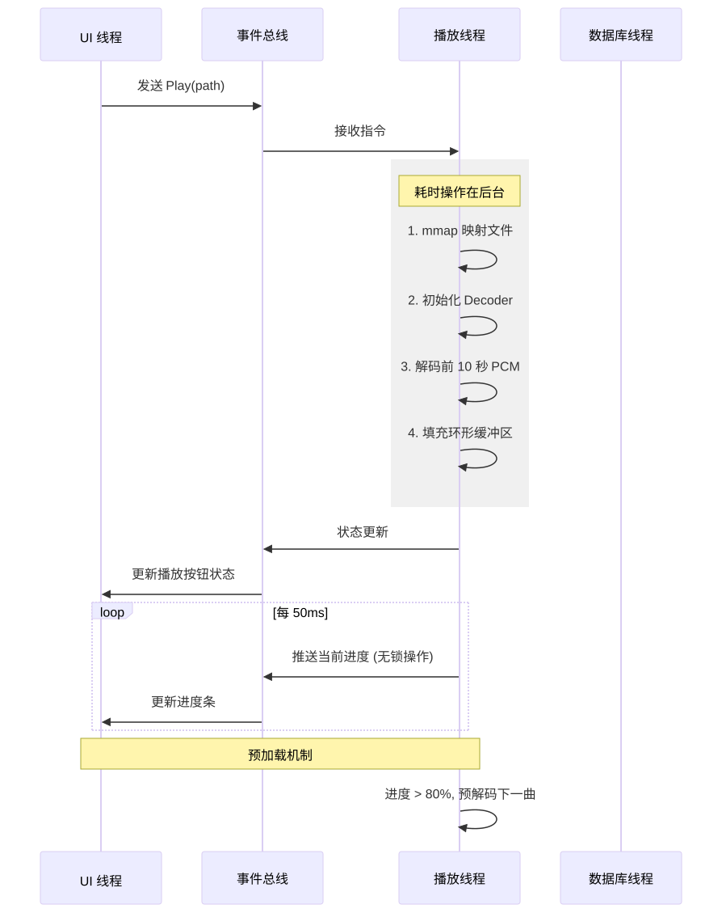

整个项目按"先跑通播放、再注入智能"的节奏分 6 个阶段，总周期约 20–28 周。每个阶段都给出交付物、关键库、验收标准、Agent Prompt 要点，可直接作为多 Agent 协作的 backlog。
Phase 0: 技术验证与脚手架（2周）
任务：搭建 Cargo workspace，验证 GPUI 能否与 rodio 在同一个事件循环中和平共处。
关键点：GPUI 有自己的事件循环，rodio 在后台线程运行。需要通过通道将 rodio 的状态变更通知到 GPUI 的主线程。
Agent Prompt:
"创建一个 Rust workspace。在主 crate 中引入 gpui 和 rodio。实现一个最小 Demo：用 rodio 在后台线程播放一个音频文件，每 100ms 通过 flume::unbounded() 通道向 GPUI 主线程发送当前播放进度。在 GPUI 窗口中渲染一个简单的文本显示这个进度。验证编译通过且无音频卡顿。"
Phase 1: 基础播放器骨架与手写组件（6周）
任务：构建播放器的基础 UI 和文件解析库。
模块：
媒体库扫描：多线程扫描本地文件夹，写入 SQLite (FTS5)。
UI 基础组件库：用 GPUI 实现自定义的 Button、Slider（进度条/音量）、ListView（支持虚拟滚动的歌曲列表）。
播放控制：连接 rodio，实现播放/暂停/上一首/下一首。
Agent Prompt:
"使用 GPUI 实现一个 Slider 组件，支持鼠标拖拽和点击定位。它需要接收 value (0.0-1.0) 和 on_change 回调。然后在主视图中实现一个虚拟滚动的歌曲列表，数据来自 SQLite 查询。当双击列表项时，通过通道发送 Play(path) 指令给后台的 rodio 播放线程。"
Phase 2: 歌词系统与频谱可视化（4周）
任务：实现 MusicPlayer2 的看家本领：逐字歌词和频谱。
关键技术：
歌词：解析 LRC（含逐字 LRC），在 GPUI 中实现带时间轴的文本渲染，支持平滑滚动和高亮当前行。
频谱：从 rodio 获取实时 FFT 数据（使用 rustfft），通过 GPUI 的 paint_path 或直接操作底层绘制指令画出频谱条。
Agent Prompt:
"实现一个 LyricView GPUI 组件。它订阅核心引擎的 position_update 事件。内部维护一个 LRC 解析出的时间轴数组。当进度更新时，计算当前应高亮的行数，并通过 GPUI 的动画/过渡 API 平滑滚动视图。对于频谱，在 rodio 的 sink 后端插入一个自定义的 Source 包装器，提取 FFT 数据，通过通道发给 UI 线程，UI 线程用 GPUI 的 2D 绘图 API 渲染柱状图。"
Phase 3: AI Sidecar 对接与语义搜索（4周）
任务：引入 Python AI 进程，实现自然语言搜歌。
架构：Rust 主进程通过 tokio::process::Command 启动 Python 进程，通过 stdin/stdout 进行 JSON-RPC 通信。
Agent Prompt:
"实现一个 AiSidecarManager，负责启动 Python 脚本并维持长连接。在 UI 中添加一个搜索框。当用户输入'找点适合下雨天的歌'时，Rust 将查询发送给 Python Sidecar，Python 调用本地 LLM 将其转化为向量，并查询 sqlite-vss。返回歌曲 ID 列表后，Rust 更新 GPUI 的播放列表视图。Sidecar 崩溃时需要自动重启并提示用户。"
Phase 4: 对话式 AI DJ（4周）
任务：在 UI 侧边栏实现类 ChatGPT 的对话界面。
模块：
UI 实现聊天气泡列表。
LLM Function Calling：LLM 决定调用 play_song、get_now_playing 等工具时，Python 通过 RPC 调用 Rust 核心引擎的方法。
Agent Prompt:
"在 GPUI 中实现一个 ChatPanel 组件，支持流式渲染文本（模拟打字机效果）。Python 侧运行 llama.cpp/Ollama。当 LLM 输出包含 <tool_call> 标签时，解析出工具名和参数，通过 JSON-RPC 发送给 Rust 核心。例如 LLM 调用 play(song_id)，Rust 核心执行 rodio 加载播放，并将成功状态返回给 LLM 继续生成回复。"
Phase 5: 跨平台与打包发布（3周）
任务：处理 Windows/macOS 平台差异，打包分发。
关键点：GPUI 在 Windows 上的字体渲染、缩放比例处理。Python 环境的打包（推荐使用 PyInstaller 将 Python Sidecar 打包成单文件可执行程序，随 Rust 应用一起分发）。
四、 GPUI 播放器核心代码片段示意（给 Agent 参考）
以下展示了在 GPUI 中如何安全地与 rodio 交互的骨架结构：

rust

// app.rs
use gpui::{Application, Window, View, ViewContext, Entity, Render};
use rodio::{OutputStream, Sink, Decoder};
use std::sync::Arc;
use tokio::sync::mpsc;

// 播放器状态
struct PlayerState {
    sink: Arc<Sink>,
    // ... 其他状态
}

// GPUI 视图
struct PlayerView {
    player: Arc<PlayerState>,
    progress_rx: mpsc::Receiver<f32>,
}

impl PlayerView {
    fn new(player: Arc<PlayerState>, progress_rx: mpsc::Receiver<f32>) -> Self {
        Self { player, progress_rx }
    }
}

impl Render for PlayerView {
    fn render(&mut self, cx: &mut ViewContext<Self>) -> impl IntoElement {
        // 检查通道是否有新进度
        if let Ok(progress) = self.progress_rx.try_recv() {
            // 触发重绘
            cx.notify();
        }

        div()
            .flex()
            .flex_col()
            .child(
                button("Play", cx.listener(|this, _ev, cx| {
                    this.player.sink.play();
                    cx.notify();
                }))
            )
            .child(
                // 显示进度的自定义组件
                div().h(px(4.0)).w_full().bg(gpui::rgb(0x333333))
            )
    }
}

fn main() {
    // 1. 初始化 rodio 音频流 (在单独线程)
    let (_stream, stream_handle) = OutputStream::try_default().unwrap();
    let sink = Sink::try_new(&stream_handle).unwrap();
    let player = Arc::new(PlayerState { sink: sink.clone() });

    // 2. 创建通道用于进度通信
    let (tx, rx) = mpsc::channel(100);

    // 3. 启动进度上报线程
    std::thread::spawn(move || {
        loop {
            if !sink.empty() {
                let pos = sink.get_pos().as_secs_f32();
                let _ = tx.blocking_send(pos);
            }
            std::thread::sleep(std::time::Duration::from_millis(50));
        }
    });

    // 4. 启动 GPUI
    Application::new().run(|cx: &mut AppContext| {
        let window = cx.open_window(WindowOptions::default(), |cx| {
            // 在 GPUI 视图中共享 player 状态
            View::new(PlayerView::new(player.clone(), rx), cx)
        }).unwrap();
    });
}

技术要点
要实现一个拥有十万级甚至百万级曲库且“列表滑动如丝般顺滑、播放永不卡顿”的本地播放器，核心在于严格的线程隔离、数据分页、虚拟化渲染和内存映射。

以下是实现这一目标的 4 大核心技术要点，以及对应的 Rust 架构设计建议。

一、 智能媒体库扫描与解析（解决“导入时卡死”）
当用户添加一个包含 50,000 首歌的文件夹时，如果主线程去遍历目录并读取每一个 MP3 的 ID3 标签，UI 会直接冻住。

技术要点：

并行遍历与增量扫描
使用 ignore 或 walkdir crate 遍历目录，利用 rayon 进行并行处理。
增量扫描：记录文件的修改时间（mtime）和大小。下次启动时，只扫描 mtime 发生变化的文件，极大地缩短启动加载时间。
轻量级元数据读取
读取标签时，不要将整个文件读入内存。使用 lofty（Rust 的音频标签库），它只会读取文件头部和尾部的几百字节，速度极快。
流式批量写入数据库
不要扫描完一首就写一次 SQLite。在内存中积攒 500-1000 条记录，使用单次事务批量 INSERT，性能可提升百倍。
Agent Prompt 指导：

"使用 rayon 的 ParallelIterator 遍历目录。对于每个音频文件，使用 lofty 读取前 100KB 数据解析标签。将解析结果收集到 crossbeam-channel 中，由一个单独的 DB Writer 线程接收，每 1000 条触发一次 SQLite 事务写入。UI 通过观察通道的进度计数器更新进度条。"

二、 SQLite 极致查询优化（解决“列表加载慢”）
当歌单包含 10 万首歌时，执行 SELECT * FROM songs 会瞬间撑爆内存。

技术要点：

开启 WAL 模式
必须开启 SQLite 的 Write-Ahead Logging (PRAGMA journal_mode=WAL;)。这样允许在写入（后台扫描）的同时进行并发读取（UI 列表加载），互不阻塞。
游标分页加载
UI 列表永远不要一次性查询所有数据。使用 LIMIT 和 OFFSET，或者更高性能的 Keyset Pagination（WHERE id > last_id LIMIT 100）。
FTS5 倒排索引异步构建
插入数据后，FTS5 索引的构建会拖慢写入。可以通过 trigger 触发，在后台空闲时异步更新索引。
三、 虚拟列表渲染（解决“列表滚动卡顿”）
这是前端 UI 最关键的一步。无论用 GPUI 还是 Tauri+React，列表中同时存在于 DOM/视图树中的元素绝对不能超过 100 个。

技术要点：

绝对虚拟化
无论列表有 10 万项还是 100 万项，只渲染当前屏幕可见的例如 30 行，加上下各缓冲 10 行，总共约 50 个 UI 节点。
滚动时，不创建/销毁节点，而是回收复用（节点池模式），只更新节点的文本内容和偏移位置。
高度固定与快速定位
列表项高度必须固定（或预计算）。这样可以通过 index * item_height 瞬间计算出滚动条位置，避免布局重排。
异步加载专辑封面
封面图片绝不同步加载。UI 渲染文本时，封面位置留空或显示占位图。后台线程异步解码图片（解码为 GPU 纹理），完成后通过事件发送给 UI 更新。
缓存策略：封面图片解码后，在内存中维护一个 LRU Cache（如最多缓存 500 张），避免来回滚动时重复解码。
Agent Prompt 指导（针对 GPUI）：

"实现一个 VirtualListView。它接收总条目数和 item_height。通过监听滚动事件，计算当前可见区间 [start_idx, end_idx]。只对这个区间内的数据调用数据源获取文本。使用一个固定大小的 Vec<Entity<ListItem>> 作为节点池，滚动时通过更新 style::offset 移动它们的位置，并更新内部文本，绝对不要在滚动回调中创建新实体。"

四、 播放引擎与预加载机制（解决“切歌卡顿”）
播放器卡顿往往发生在切歌的瞬间：读取大文件、解码初始化、格式转换都会消耗时间。

技术要点：

严格的双线程隔离
UI 线程：只负责渲染和接收点击。
播放线程：独立的后台线程，持有 OutputStream 和 Sink。UI 线程通过无锁通道（flume 或 tokio::sync::mpsc）发送指令（如 Play, Pause, Next），绝对不要在 UI 线程触碰任何音频解码 API。
内存映射
读取音频文件时，不要用 File::open().read_to_end()。使用 memmap2 crate 将文件映射到虚拟内存。操作系统会自动按需加载页面，对于 FLAC 这类大文件，启动播放的速度可以缩短到微秒级。
下一曲预加载
当当前歌曲播放进度达到 80% 时，后台线程静默地开始打开下一首的文件句柄，初始化 Decoder，并预解码前几帧填满缓冲区。
当当前歌曲结束时，直接无缝切换 Sink 的数据源，实现真正的“零延迟切歌”。
环形缓冲区
解码后的 PCM 数据放入一个有界环形缓冲区（如 1MB）。如果 UI 线程偶尔卡顿（比如拖动窗口），导致消费速度变慢，缓冲区可以吸收这些抖动，保证音频不中断。
架构流转图（以 Rust 为例）

sequenceDiagram
    participant UI as UI 线程
    participant Bus as 事件总线
    participant Player as 播放线程
    participant DB as 数据库线程

    UI->>Bus: 发送 Play(path)
    Bus->>Player: 接收指令
    
    rect rgb(240, 240, 240)
    Note over Player: 耗时操作在后台
    Player->>Player: 1. mmap 映射文件
    Player->>Player: 2. 初始化 Decoder
    Player->>Player: 3. 解码前 10 秒 PCM
    Player->>Player: 4. 填充环形缓冲区
    end
    
    Player->>Bus: 状态更新
    Bus->>UI: 更新播放按钮状态
    
    loop 每 50ms
        Player->>Bus: 推送当前进度 (无锁操作)
        Bus->>UI: 更新进度条
    end

    Note over Player,UI: 预加载机制
    Player->>Player: 进度 > 80%, 预解码下一曲
总结给开发者的建议：
把上述机制转化为代码时，核心记住一句话：“UI 是个瞎子，只看通道里传来的数字；播放器是个聋子，只听通道传来的指令。” 只要你严格用消息通道隔离开 UI 渲染、磁盘 IO 和音频解码，即使加载百万首歌曲，播放器也能保持 0% 的 CPU 空闲占用和极致的响应速度。